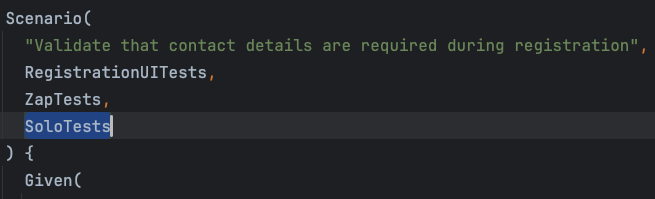

# Digital Senior Accounting Officer (DSAO) Frontend Acceptance Tests

----

>  **Current chrome issue**:
> [21/11/25] There is a current issue when running tests using later versions of chrome as per https://hmrcdigital.slack.com/archives/C0J8BH46N/p1760607965741119.
As a workaround we must use version 128. In order to do so we must also add the following properties to the CLI
>>` -Dbrowser.usePreviousVersion=true `
>
>For the foreseeable future (this applies to all subsequent commands associated with chrome)
e.g. Run the following command to trigger the test via the CLI.
>>sbt clean -Dbrowser="chrome" -Denvironment="local"  -Dbrowser.usePreviousVersion=true test
>
>The scripts are also updated, and once this is fixed we'll need to remove them

----

## Running Tests

* Start the needed services in a terminal session with the following command:

```bash
sm2 --start SAO_ALL
```

* Run your tests with the following command:

```bash
sbt clean -Dbrowser="chrome" -Denvironment="local" test
```

| Parameter | Supported values              |
|-----------|-------------------------------|
| `-Dbrowser` | `chrome`, `edge`, `firefox` |
| `-Denvironment` | `local`, `dev`, `qa`    |


### Convenience scripts
We have a few convenience scripts that take `chrome` as a default value for browser and `local` as environment.

#### 1. Run all tests

* From your terminal, run the following command:

```bash
 ./run_all_tests.sh
```

#### 2. Run individually selected tests

* Add the `SoloTests` tag to the scenario(s) you wish to run as per the below example:

> 

* From your terminal, run the following command:

```bash
 ./run_solo_tests.sh
```

* Remember to remove the `SoloTests` tag(s) added when testing before pushing code to a pull request.

#### 3. Run ony the `submission` tests

* To run only the submission tests, ensure `SubmissionUITests` tag is added to the respective scenario(s). These should already be tagged.
* From a terminal run:

```bash
 ./run_submission_ui_tests.sh
```

#### 4. Run ony the `registration` tests

* To run only the registration tests, ensure `RegistrationUITests` tag is added to the respective scenario(s). These should already be tagged.
* From a terminal run:

```bash
 ./run_registration_ui_tests.sh
```

#### 5. Executing a local Zed Attack Proxy (ZAP) test

* First [run the DAST tool locally](https://github.com/hmrc/dast-config-manager/blob/main/README.md#running-zap-locally).
* The following script is available to execute ZAP tests. The script proxies the journeys tagged with 'ZapTests' via ZAP.

```bash
./run_local_zap_tests.sh
```

### Manual Upscan testing in MongoDB

**Steps to verify in MongoDB Compass that the 'user-answers' collection is updated for the upload submission template.**

* Before connecting to mongoDB, please ensure the Upscan service is up and running locally on sm2.
* Run the 'mongosh' command in the terminal to retrieve the mongoDB url (e.g. URL: mongodb://127.0.0.1:27017/?directConnection=true&serverSelectionTimeoutMS=2000&appName=mongosh+2.8.2).
* Launch MongoDB Compass, paste the mongoDB url into connection field , and connect to the database.
* Navigate to and open the 'user_answers' collection under the senior-accounting-officer-submission-frontend.
* The 'data.notificationUpload.reference' is added and the 'statusType' is set to 'InProgress'  in the 'user-answers' collection after  user navigates to  the notification upload form page on  UI.
* The 'statusType' is updated to 'UploadedSuccessfully' after user uploaded  csv file on UI, and refresh the collection  to verify the updated 'statusType'.

----

## Scalafmt

**Check all project files are formatted as expected as follows:**

```bash
sbt scalafmtCheckAll scalafmtCheck
```

**Format `*.sbt` and `project/*.scala` files as follows:**

```bash
sbt scalafmtSbt
```

**Format all project files as follows:**

```bash
sbt scalafmtAll
```

[Visit the official Scalafmt documentation to view a complete list of tasks which can be run.](https://scalameta.org/scalafmt/docs/installation.html#task-keys)

----

## License

**This code is open source software licensed under
the** [Apache 2.0 License]("http://www.apache.org/licenses/LICENSE-2.0.html").
